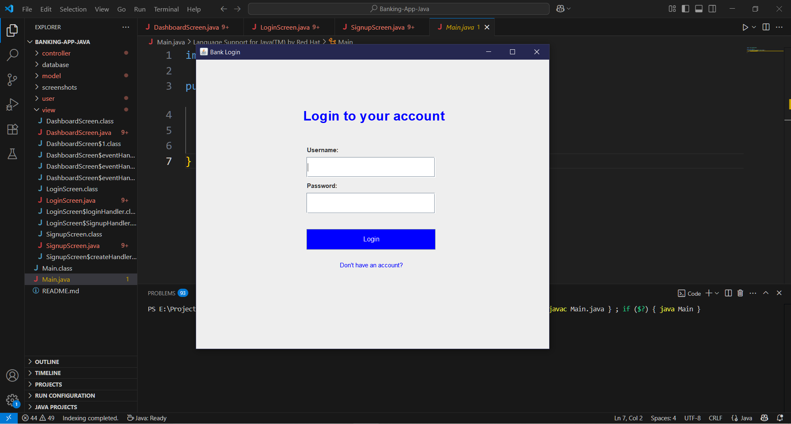
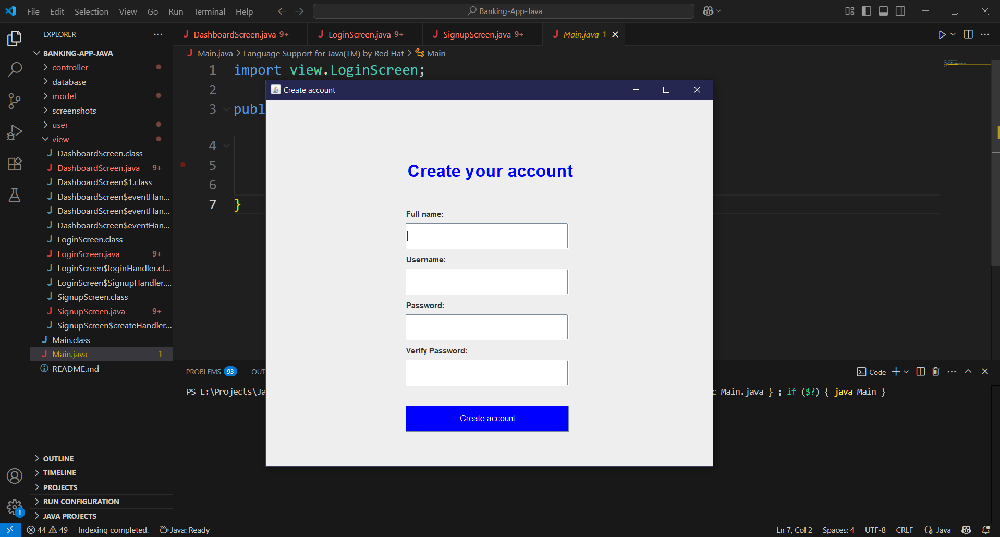
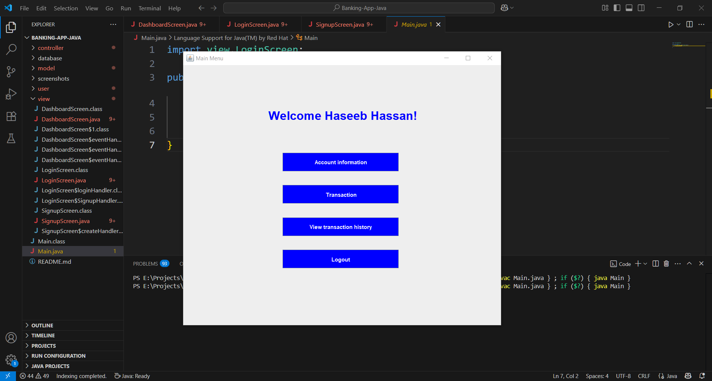

# 🏦 Banking-App-Java

A simple banking system built in Java using Java Swing, AWT, JDBC, and MySQL for backend storage. The application allows users to register, log in, deposit or withdraw money, check their balance, and view transaction history.

---

## 🚀 Features

- 🧑 User Registration and Login  
- 💰 Deposit & Withdrawal  
- 💳 Balance Inquiry  
- 📜 Transaction History  
- 🧩 MySQL Database Integration  

---

## 🛠 Technologies Used

- Java (Swing, AWT for GUI)  
- JDBC (Java Database Connectivity)  
- MySQL (for relational database)  

---

## 📁 Project Structure

Banking-App-Java/
│
├── controller/ # Event handling and control logic
├── database/ # SQL file to create required MySQL tables
├── model/ # Data access layer (Database operations)
├── user/ # User model and logic
├── view/ # GUI screens (Login, Dashboard, Forms)
├── screenshots/ # UI screenshots for documentation
└── Main.java # Application entry point

---

## 🖥️ How to Run

### ✅ Prerequisites

- Java JDK 8 or above  
- MySQL installed and running  
- Java IDE (e.g., VScodeIntelliJ, Eclipse, NetBeans)  
- MySQL JDBC Driver (e.g., `mysql-connector-java`)  

---


### ▶️ Setup Instructions

1. **Clone the Repository**
   ```bash
   git clone https://github.com/Haseeb-Hassan66/Banking-App-Java.git
   cd Banking-App-Java
   ```

2. **Create the Database**
   - Open **MySQL Workbench**, phpMyAdmin, or MySQL terminal.
   - Run the SQL script located in:
     ```
     database/bankdb.sql
     ```
     This will create all the required tables for the application.

3. **Configure Database Connection**
   - In your DB connection class (e.g., `DBConnection.java`), update the following:
     ```java
     String url = "jdbc:mysql://localhost:3306/bankdb";
     String user = "root";
     String password = "your_mysql_password";
     ```
   - Make sure the database name in the URL matches the one created from the SQL file.

4. **Add MySQL JDBC Driver**
   - Download the MySQL JDBC driver (`mysql-connector-java`) from the [official site](https://dev.mysql.com/downloads/connector/j/).
   - Add the `.jar` file to your project’s classpath or library dependencies.

5. **Run the Application**
   - Open `Main.java` in your Java IDE.
   - Run the file to start the banking system GUI.

### 📸 Screenshots

### 🔐 Login Page


### 💰 Sign-up Page


### 💳 User Dashboard


